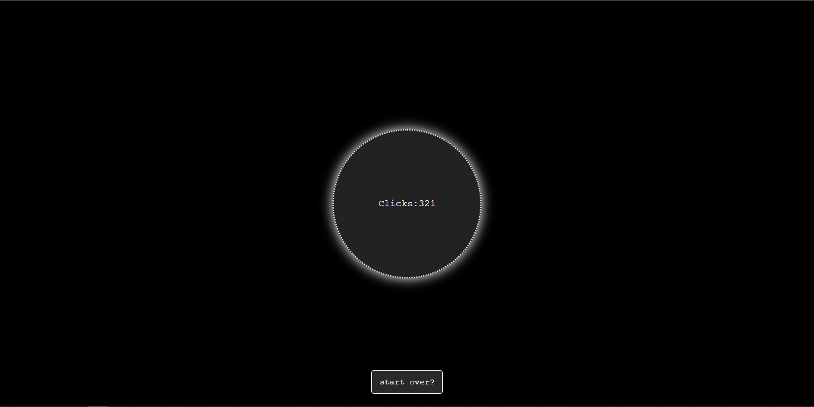

# SPC (Space Per Click)!
have you even found youself zoning out and pressing space on your keyboard (i have found myself in this exact situation a lot) well dont worry now you can see how many time you clicked space for no reason!

## how to use it
just press space. its not that hard to figure out -_-
if u want to forget how many clicks you took away from your space keys life you can press the button in bottom!

## features
* really clean and dark mode ui
* round circle to show you click!
* achivements are there too! u gotta figure it out yourself :/
* oh and it can remember after u close the browser >:)

## Screenshot of the page!
yeah thats the only ss.

## how i made
It is made with html, css and javascript. 

copied my own code from different my own projects! 

no but really this is one of the first project i built without the help of ai.

## well hope you like it!
